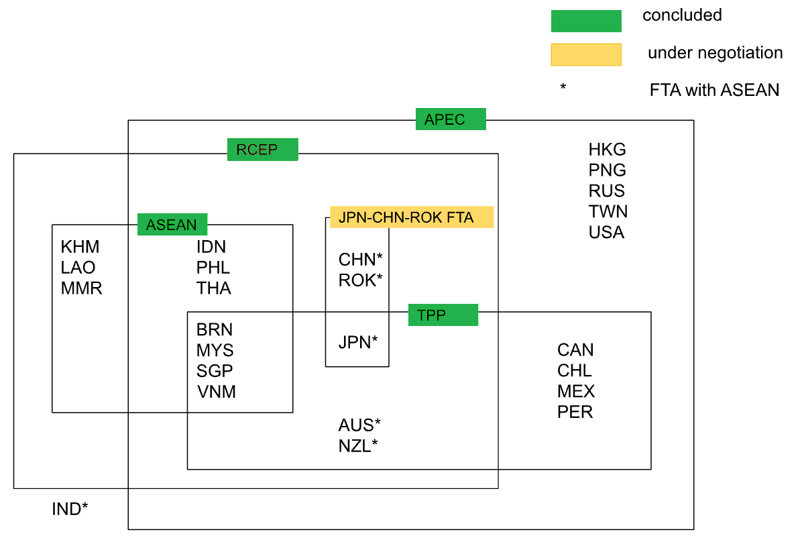
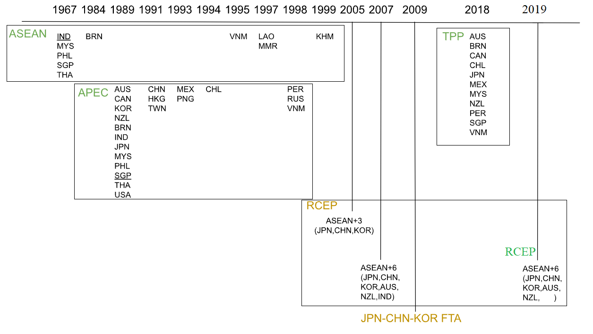
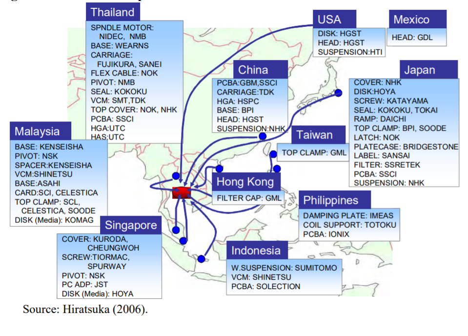

 
 

***

# 1. Regional economic integration
Lowering barriers to cross-border movement of people, goods and money
 
 

- 1.1 Economic benefits

  --Improve market efficiency
 
 
 
  --Share the costs of public goods or large infrastructure projects
 
 
 
  --Decide policy cooperatively and have an anchor to reform
 
 
 
  --Have a building block for global integration
 
 
 
  --Reap other non-economic benefits, such as peace and security
 
 
 
  --But, countries may have different priorities, regional integration may also create winners and losers 
 
 
 

  [Source: Overview of Regional Integration (The World Bank)](https://www.worldbank.org/en/topic/regional-integration/overview#1) 

- 1.2 Types of integration

  -- Customs union
 
 
 
 
 

  -- Common market
 
 
 
 
 

  -- Monetary/Economic union
 
 
 
 
 

  [Source:TYPES OF ECONOMIC INTEGRATION (http://www.learneurope.eu)](http://www.learneurope.eu/index.php?cID=306)

# 2. Major FTAs/EPAs in Asia-Pacific Region

 
 
 

## 2.1 Scope

source: Adapted from https://www.mofa.go.jp/policy/other/bluebook/2016/html/chapter3/c030301.html

 

## 2.2 Progress

 

***
# 3. Some regional coorperation frameworks

 
 
 

## 3.1 Mekong River Commision (MRC) and Greater Mekong Subregion (GMS)
 
MRC: Cambodia, Laos, Myanmar, Thailand, Vietnam 
GMS: MRC + Guangxi and Yunnan of China

[Source:The Greater Mekong Subregion 2030 and Beyond: Integration, Upgrading, Cities, and Connectivity (Asian Development Bank)](https://www.adb.org/publications/gms-2030-integration-upgrading-cities-connectivity)

 
 
 
 
 
 
 
 
 
 
 
 
 
 
 
 
 
 
 
 

## 3.2 Indonesia–Malaysia–Singapore (SIJORI) Growth Triangle
 
SIJORI: Singapore, Johor and Riau

[Source:Formation of SIGORI Growth Triangle (The Government of Singapore)](https://eresources.nlb.gov.sg/history/events/bd4d0374-63ae-49fe-95c8-2210b3b0ac59)

 
 
 
 
 
 
 
 
 
 
 
 
 
 
 
 
 
 
 
 

# 4. De facto VS De Jure Economic Integration

 
 
 

 
 

# 5. Beyond spaghetti bowl integration 

[Source: Hiratsuka (2007)](https://www.ide.go.jp/library/English/Publish/Reports/InterimReport/2007/pdf/Ch9_Hiratsuka.pdf)
 
 
 
 
 
 
 
 
 
 
 
 
 
 
 
 
 
 
 
 